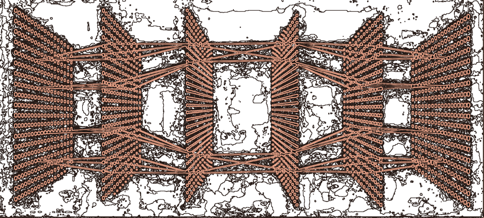

[📰 **Papers**](https://doi.org/10.1101/2024.11.25.24317759) |
[🎙️ **Conferences**](linear_prediction/linear_visualization/readme.md) |
[🛠️ **Projects**](src/EDA/patient_visualization/readme.md) 

# About Me 🧠

I hope to make my own contribution to medical scientific research in my future. Electronic and AI&R engineering background to tackle challenges in medicine, neuroscience and neuroengineering. New decoding systems of CNS signals, a better understanding of the human brain, the mechanics behind memory, reasoning, knowledge and deduction is the breakthrough that people need today.

