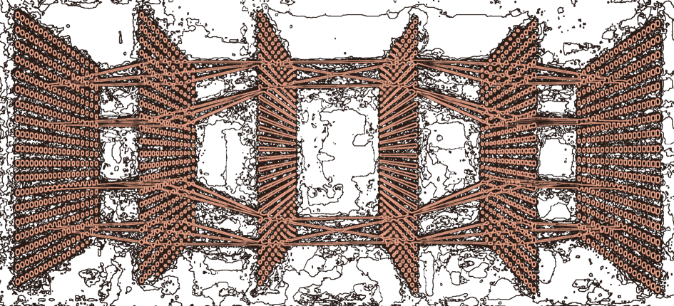

[👋 **Bio**]() |
[**Projects**🛠️](src/EDA/patient_visualization/readme.md) 

[📰 **Papers**](https://doi.org/10.1101/2024.11.25.24317759) |
[**Conferences**🎙️](linear_prediction/linear_visualization/readme.md) 

**Deep Learning for Neuroengineering**

# About Me 🧠

I hope to make my own contribution to medical scientific research. Electronic and AI&R engineering background to tackle challenges in medicine, neuroscience and neuroengineering. New decoding systems of CNS signals, a better understanding of the human brain, the mechanics behind memory, reasoning, knowledge and deduction is the breakthrough that people need today.

# Interests🧐

- Neuroengineering
- Neural Decoding
- Neural Information Processing
- Deep Learning
- Artificial Intelligence

# Education📚

📠 ⟳   **Ph.D. Biorobotics**  *Sant'Anna School of Advanced Studies*

📠**MSc Artificial Intelligence and Robotics**  *Sapienza University of Rome* & *SSAS*

📠**BSc Electronic Engineering**  *University of Catania*

